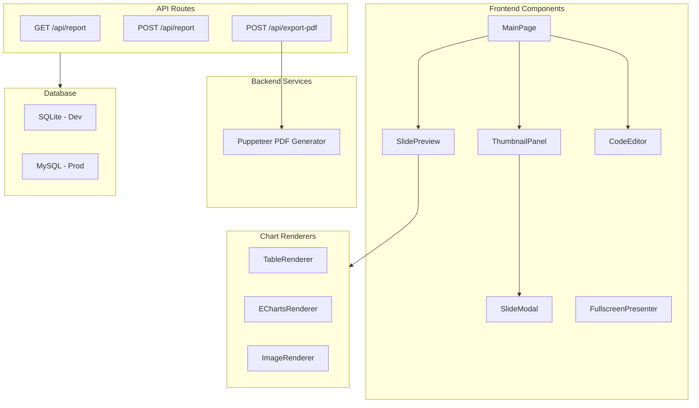
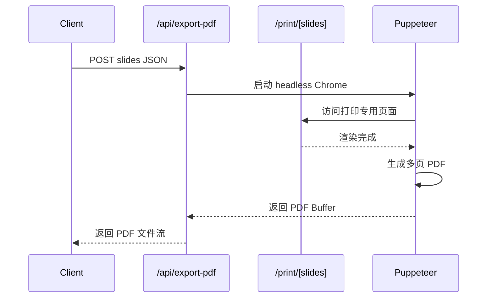

# 宏观经济报告PPT Studio 实现计划

## 架构概览




## 技术选型

| 功能 | 技术方案 ||------|----------|| 框架 | Next.js 15 (App Router) || 样式 | Tailwind CSS + shadcn/ui || 数据库 | Drizzle ORM + SQLite(dev)/MySQL(prod) || 代码编辑器 | Monaco Editor || 图表 | ECharts || **PDF导出** | **Puppeteer (后端渲染)** || 拖拽排序 | @dnd-kit/core |

## PDF 导出方案（后端）




- 创建 `/print` 路由作为 PDF 专用渲染页面
- 使用 Puppeteer 访问该页面并生成 PDF
- 每张幻灯片为一页，保持 16:9 比例
- 等待 ECharts 图表渲染完成后再截取

## 实现步骤

### Phase 1: 项目初始化与基础配置

1. 使用 `create-next-app` 初始化 Next.js 15 + TypeScript + Tailwind 项目
2. 安装并配置 shadcn/ui 组件库
3. 配置 Drizzle ORM 与 SQLite 数据库连接
4. 创建 `ppt_reports` 表结构

### Phase 2: 核心类型定义与状态管理

定义核心 TypeScript 类型：

```typescript
// types/slide.ts
interface SlideData {
  title?: string;
  content: string[];
  charts: ChartConfig[];
}

interface ChartConfig {
  type: 'table' | 'echarts' | 'image';
  data: TableData | EChartsOption | ImageData;
}
```


### Phase 3: 幻灯片渲染组件

1. **SlideRenderer** - 主渲染组件，根据内容/图表数量自适应布局
2. **TableChart** - 表格渲染（支持单元格样式）
3. **EChartsChart** - ECharts 图表渲染
4. **ImageChart** - 图片渲染

布局策略（基于spec中的设计图）：

- 论点区域在上方，根据数量分1-2列
- 图表区域在下方，根据数量自适应网格

### Phase 4: 主页面开发

1. **ThumbnailPanel** - 左侧缩略图列表

- 添加按钮（+）
- 缩略图预览（16:9缩放）
- 拖拽排序（@dnd-kit）
- 悬停显示编辑菜单（...）
- 缩略图间插入按钮

2. **SlidePreview** - 主预览区域（16:9比例）
3. **CodeEditor** - 源码模式（Monaco Editor）
4. **Toolbar** - 顶部工具栏（发布/导出PDF/源码预览切换/全屏）

### Phase 5: 幻灯片配置模态框

1. **SlideModal** - 配置/源码双模式

- 标题输入
- 论点列表（动态增删，0-4个）
- 图表配置（类型选择 + JSON配置，0-4个）
- 源码模式（完整JSON编辑）

### Phase 6: API 与数据持久化

```javascript
src/app/api/report/route.ts
  GET  - 获取最新发布的PPT配置
  POST - 保存/发布PPT配置

src/app/api/export-pdf/route.ts
  POST - 接收slides数据，使用Puppeteer生成PDF并返回
```


### Phase 7: PDF 打印页面与导出

1. 创建 `/print` 页面专门用于 PDF 渲染
2. 实现 Puppeteer PDF 生成逻辑
3. 配置页面尺寸为 16:9 横向布局

### Phase 8: 全屏演示

- 使用 Fullscreen API 实现全屏
- 监听滚轮事件切换幻灯片

## 目录结构

```javascript
src/
├── app/
│   ├── page.tsx              # 主页面
│   ├── layout.tsx
│   ├── print/
│   │   └── page.tsx          # PDF打印专用页面
│   └── api/
│       ├── report/route.ts   # 报告CRUD API
│       └── export-pdf/route.ts # PDF导出API
├── components/
│   ├── slide/
│   │   ├── SlideRenderer.tsx
│   │   ├── TableChart.tsx
│   │   ├── EChartsChart.tsx
│   │   └── ImageChart.tsx
│   ├── editor/
│   │   ├── ThumbnailPanel.tsx
│   │   ├── SlidePreview.tsx
│   │   ├── SlideModal.tsx
│   │   └── CodeEditor.tsx
│   ├── presentation/
│   │   └── FullscreenPresenter.tsx
│   └── ui/                   # shadcn组件
├── lib/
│   ├── db/
│   │   ├── index.ts          # Drizzle连接
│   │   └── schema.ts         # 表结构定义
│   └── pdf-generator.ts      # Puppeteer PDF生成
└── types/
    └── slide.ts              # 类型定义


```