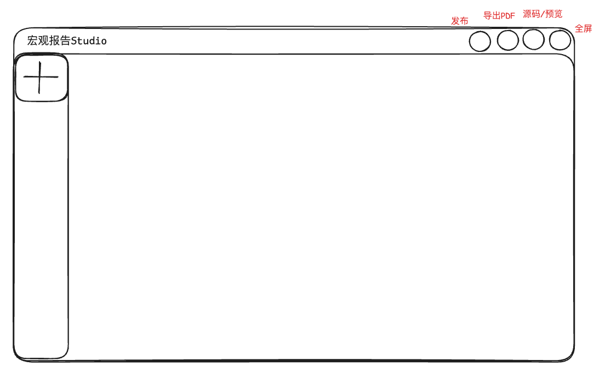
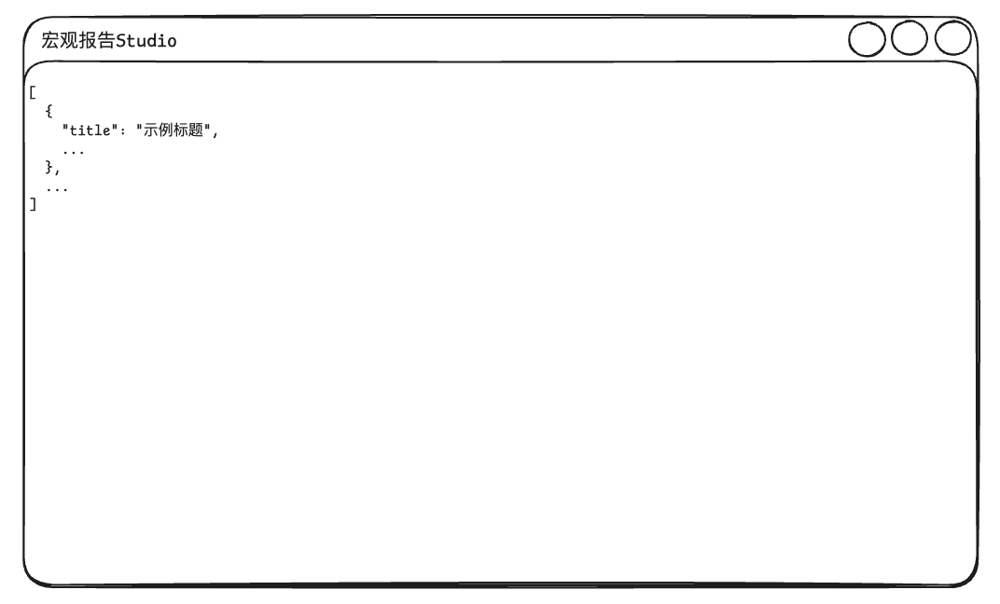
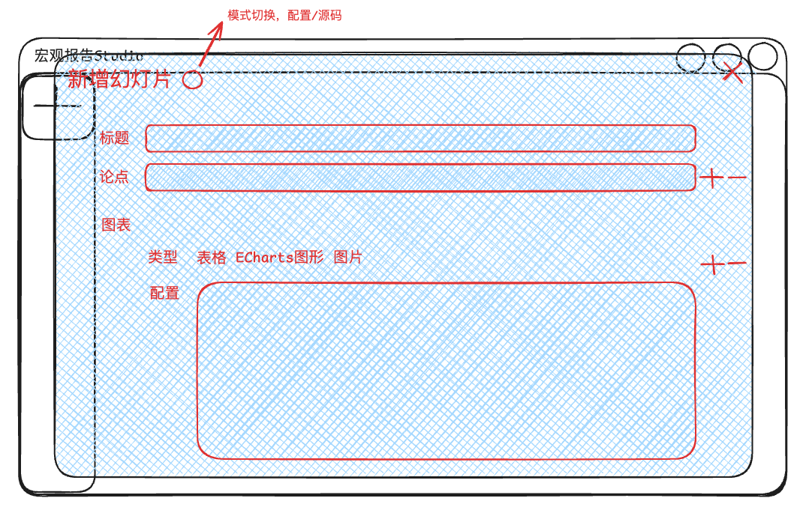
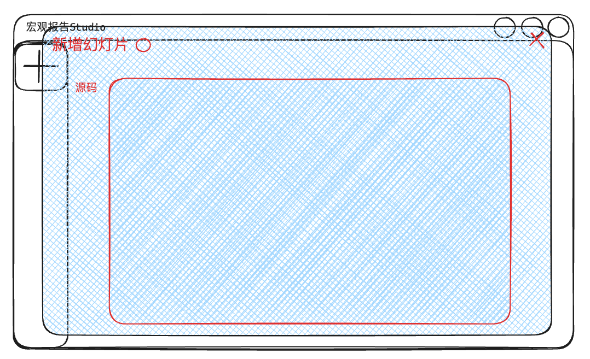
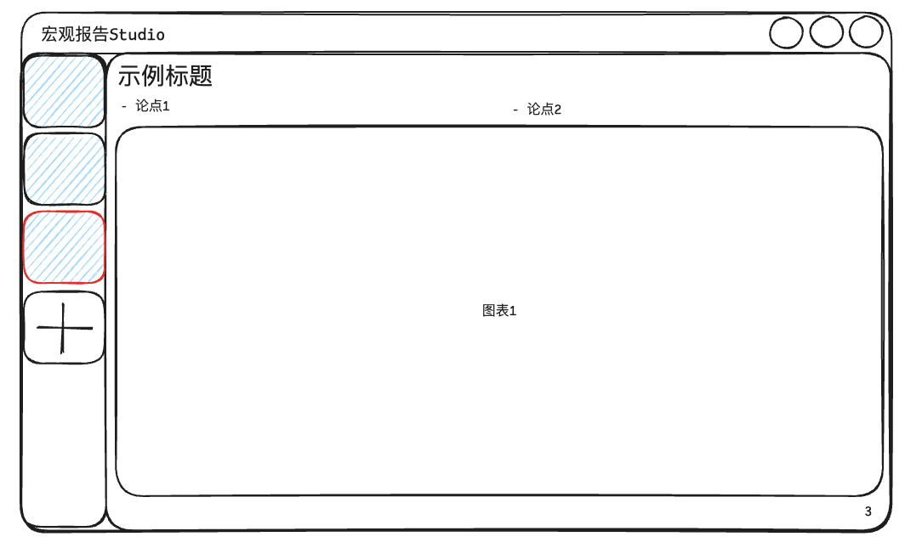
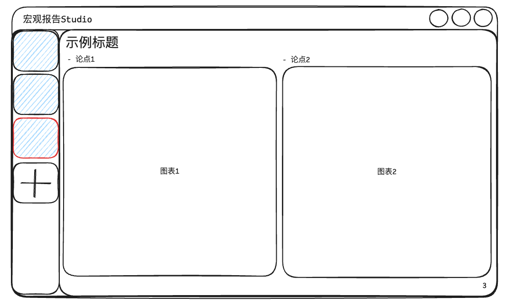
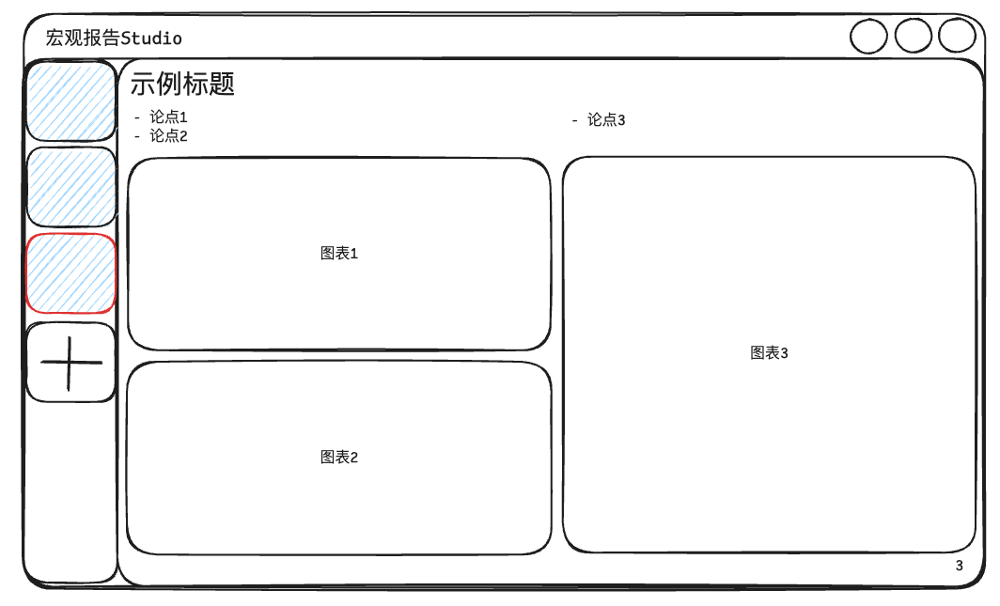
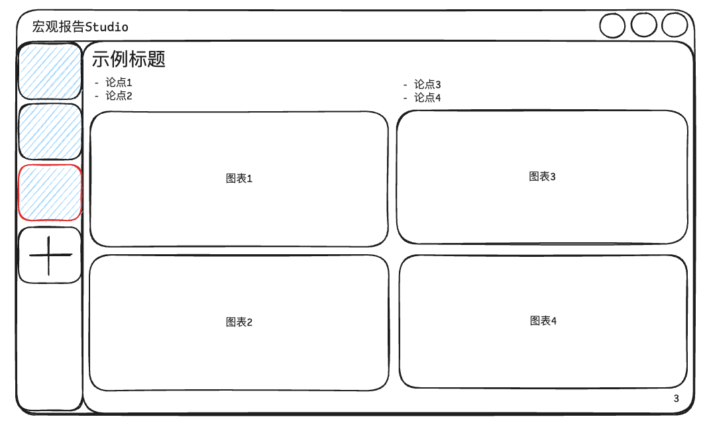

# 宏观经济报告PPT Studio项目

## 目标

我想做一个Web应用，定位是一个宏观经济报告PPT Studio，能够通过可视化点击配置或者JSON源码的方式配置、渲染PPT页面，单个幻灯片页面主要由"标题"、"论点"、"图表"和右下角的"页码"四部分区域组成，并且还包含PPT保存发布、幻灯片全屏演示、导出PDF文件和整体PPT预览/源码模式切换的功能。

## 风格

现代、美观、简约

## 概要设计

### 1. 主页面

用户进到应用中，默认进到预览模式，设计如



所示，一进来默认通过http请求获取最新发布的PPT的JSON源码，然后加载渲染到当前报告中，如果请求失败或内容为空则为空白。

PPT工作区由宽高比为16:9幻灯片预览组件和左侧的幻灯片缩略图集组件组成。

右上角的包含"发布"、"导出PDF"、"源码/预览"和"全屏演示"功能.

当点击"发布"时，会将当前PPT的json内容发送到后台保存到数据库中，下次进来时就会拉取到这个最新的配置。

当点击"全屏演示"时，以16:9的宽高比全屏展示当前幻灯片页面，通过鼠标滚轮的方式切换上下页。

当点击"导出PDF"时，以全屏状态下的幻灯片样子为准导出多页pdf文件。

当点击"源码/预览"切换按钮时，PPT工作区就会变成源码编辑器，如



所示。

### 2. 新增幻灯片页面

点击幻灯片缩略图集组件的"+"位置，弹出幻灯片配置模态框，可以配置"标题"、"论点"和"图表"，设计如



所示。其中，如果标题为空字符串则不占高度，论点可以配置0~4个，图表可以配置0~4个，点击"+"可以新增条目，"-"则删除条目。

图表有3种类型可以配置，"表格"、"ECharts图形"和"图片"，以下是配置示例

表格：

```json
{
    "col1": [1, 99, {"value": 2, "font-weight": "bold"}],
    "col2": [3, {"value": 4, "color": "red"}, 87]
}
```

解释：当前表格有2列，其中第1列最后一行的"2"加粗，第2列的第二行的"4"字体为红色，font-weight和color都会遵循css style的规范。

ECharts图形：

```json
{
  "xAxis": {
    "type": "category",
    "data": ["Mon", "Tue", "Wed", "Thu", "Fri", "Sat", "Sun"]
  },
  "yAxis": {
    "type": "value"
  },
  "series": [
    {
      "data": [150, 230, 224, 218, 135, 147, 260],
      "type": "line"
    }
  ]
}
```

解释：完全遵循ECharts规范的配置。

图片：

```json
{
  "src": "https://example.com/logo.png"
}
```

解释：完全遵循ECharts规范的配置。

当点击模态框"新增幻灯片"旁边的模式切换按钮时，切换到当前幻灯片页面的源码编辑器模式，如



所示，一个页面的示例json如下所示：

```json
{
    "title": "这是一个示例页面的title",
    "content": [
        "这是论点1",
        "我是论点2",
    ],
    "charts": [
        {
            "type": "table",
            "data": {
                "col1": [1, 99, {"value": 2, "font-weight": "bold"}],
                "col2": [3, {"value": 4, "color": "red"}, 87]
            }
        },
        {
            "type": "echarts",
            "data": {
                "xAxis": {
                    "type": "category",
                    "data": ["Mon", "Tue", "Wed", "Thu", "Fri", "Sat", "Sun"]
                },
                "yAxis": {
                    "type": "value"
                },
                "series": [
                    {
                        "data": [150, 230, 224, 218, 135, 147, 260],
                        "type": "line"
                    }
                ]
            }
        },
        {
            "type": "image",
            "data": {
                "src": "https://example.com/logo.png"
            }
        }
    ]
}
```

特别说明，以上```json```前后缀只是当前说明使用，真实配置时只会直接填入JSON代码。

鼠标挪到幻灯片缩略图集的某个缩略图的右上角时，会出现"..."图标，点击后可以进入到这个幻灯片的配置页面。

鼠标挪到两个缩略图中间留白处会出现一个小"+"号，点击弹出新幻灯片配置页面，配置完成后可以在这个位置插入一个新的幻灯片。

鼠标左键长按某个缩略图可以抓起、上下移动当前幻灯片的位置

### 3. 幻灯片页面中不同内容的布局设计

**2论点、1图表**



**2论点、2图表**



**3论点、3图表**



**4论点、4图表**



## 技术栈

typescript + next.js 16 + tailwind css + shadcn/ui + drizzle orm + sqlite(dev)/mysql(prod)

## 表结构设计

PPT内容发布存储表：

```sql
create table ppt_reports (
    id int not null auto_increment comment '主键',
    report text null comment 'ppt报告的完整json配置代码',
    create_time datetime not null default current_timestamp comment '创建时间',
    primary key (id)
)
```